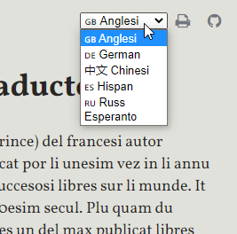

---

## P. N. Coudenhove-Kalergi

# PAN-EUROPAN MANIFEST

TRADUCTION EX GERMAN IN LI LINGUE INTERNATIONAL OCCIDENTAL

EUGEN MOESS.

VIENNA 1926.

LI OFICIE CENTRAL DEL PANEUROPAN UNION ES VIENNA (WIEN), HOFBURG, MARSCHALLSTIEGE.

PRINTERÍA A. ELKEN, REVAL, ESTONIA.

---

### Usage

Iluminar un sol parol por vider un explication 

o iluminar mani paroles por vider un naiv traduction.

Selecter tui lingue preferet por li traductiones.

